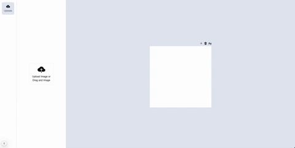

# Next.js Slide Editor App

## Demonstração

Veja abaixo uma demonstração do aplicativo em ação:




## Sobre o Projeto

Este projeto é um aplicativo baseado no famoso Canva, mas com funcionalidades personalizadas para facilitar a criação e edição de slides. Com ele, você pode:

- Fazer upload de múltiplas imagens.
- Adicionar imagens ao editor de slides.
- Redimensionar e rotacionar imagens.
- Adicionar textos.
- Criar múltiplas páginas.

### Funcionalidades Principais

- **Upload de Images:** Para adicionar imagens ao projeto basta arrastar sobre qualquer área do app ou clicar no botão de upload
- **Arraste e Solte:** Para adicionar imagens a um slide, basta arrastá-las para o editor.
- **Criação de Textos:** Clique no ícone acima da página para adicionar textos.
- **Interface Intuitiva:** O layout é simples e fácil de usar, garantindo uma ótima experiência para criação de conteúdo visual.

## Requisitos de Instalação

### Dependências do Sistema

Antes de começar, certifique-se de que seu sistema tem as bibliotecas necessárias para rodar o projeto.

#### macOS

No macOS, rode o seguinte comando no terminal para instalar as dependências:

```bash
brew install pkg-config cairo pango libpng jpeg giflib librsvg
```

#### Linux

No Linux, utilize o gerenciador de pacotes da sua distribuição. Para distribuições baseadas em Debian/Ubuntu, por exemplo:

```bash
sudo apt-get install pkg-config libcairo2-dev libpango1.0-dev libpng-dev libjpeg-dev libgif-dev librsvg2-dev
```

#### Windows

No Windows, você pode instalar as bibliotecas via MSYS2:

1. Instale o [MSYS2](https://www.msys2.org/).
2. Abra o terminal do MSYS2 e rode:

```bash
pacman -S mingw-w64-x86_64-pkg-config mingw-w64-x86_64-cairo mingw-w64-x86_64-pango mingw-w64-x86_64-libpng mingw-w64-x86_64-librsvg
```

### Configuração do Projeto

Depois de instalar as dependências do sistema, siga os passos abaixo para configurar o projeto:

1. Clone o repositório:

   ```bash
   git clone <URL_DO_REPOSITORIO>
   cd <PASTA_DO_PROJETO>
   ```

2. Instale as dependências do projeto:

   ```bash
   npm install
   ```

3. Inicie o servidor de desenvolvimento:

   ```bash
   npm run dev
   ```

4. Abra o navegador em [http://localhost:3000](http://localhost:3000) para acessar o app.

## Como Usar

1. **Adicionando Imagens:**

   - Faça o upload das imagens para a biblioteca.
   - Arraste as imagens desejadas para o editor de slides.

2. **Editando Imagens:**

   - Redimensione ou rotacione as imagens diretamente no editor.

3. **Adicionando Textos:**

   - Clique no ícone de texto localizado acima da página para adicionar novos textos.

4. **Criando Múltiplas Páginas:**
   - Navegue entre as páginas e use as ferramentas disponíveis para criar slides adicionais.

# Futuras Possíveis Melhorias

Estamos continuamente trabalhando para melhorar o aplicativo. Algumas melhorias e novos recursos que estão planejados para futuras versões incluem:

- **Clique na Imagem para Editar**: Permitir que os usuários cliquem diretamente nas imagens para acessar as opções de edição, facilitando a navegação e edição no slide.

- **Implementação de Corte (Crop) em Imagens**: Adicionar uma ferramenta de corte para que os usuários possam ajustar e cortar as imagens antes de usá-las nos slides.

- **Lista Infinita com Virtualização**: Implementar uma lista infinita com virtualização para garantir o desempenho otimizado ao trabalhar com grandes quantidades de imagens ou slides.

- **Transições e Animações nas Páginas**: Adicionar transições e animações ao criar ou alternar entre páginas para melhorar a experiência visual e interatividade.

- **Deleção de Imagens e Textos**: Permitir que os usuários possam excluir imagens ou textos diretamente do slide, oferecendo mais flexibilidade e controle durante o processo de criação.

## Licença

Este projeto está licenciado sob a [Licença MIT](LICENSE).
